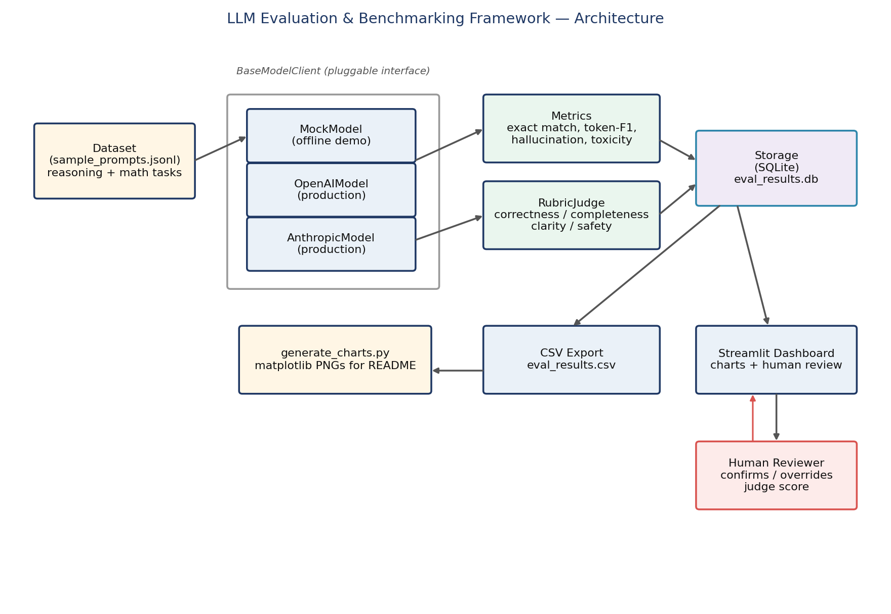
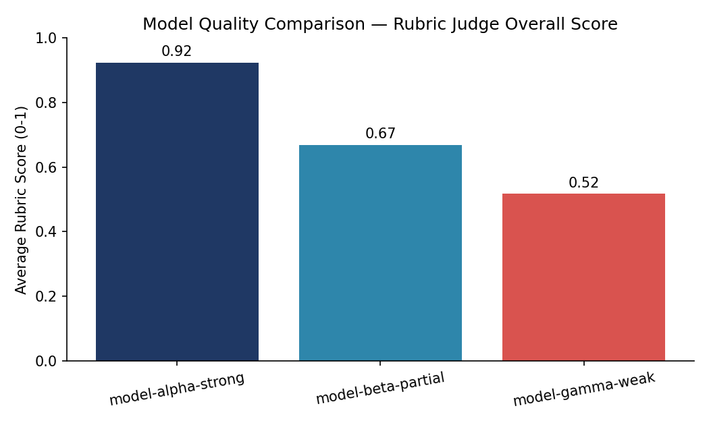
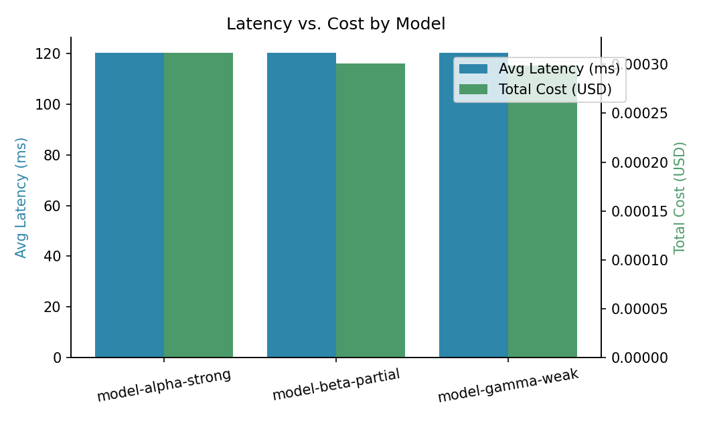
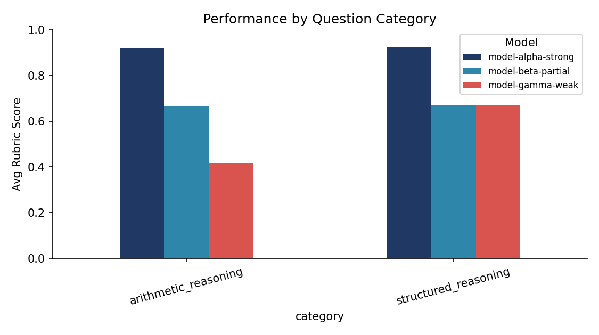

# LLM Evaluation & Benchmarking Framework

A production-shaped framework for scoring and comparing LLM outputs against structured reasoning and math benchmarks — combining automated metrics, an LLM-as-judge rubric scorer, and a human-in-the-loop review dashboard.



<p align="center">
  
  
  
  
</p>

## Table of Contents
- [Why I built this](#why-i-built-this)
- [Vision](#vision)
- [What it does](#what-it-does)
- [Results](#results-from-the-included-demo-run)
- [How this evolved](#how-this-evolved-build-log-briefly)
- [Project structure](#project-structure)
- [Setup & usage](#setup--usage)
- [What's simplified, and why](#whats-simplified-and-why)
- [Tests](#tests)

---

## Why I built this

I work as an **AI Specialist (LLM Evaluation)** at Handshake AI, where I review LLM outputs against human-annotated benchmarks and design structured reasoning/math test prompts to surface model failures. That work happens inside someone else's internal tooling — I never get to see, own, or show the actual system behind it.

This project is my answer to one question: **"If I had to build that evaluation system myself, from the ground up, what would it look like?"**

So this isn't a generic tutorial project. It's a deliberate attempt to reconstruct the *shape* of real LLM evaluation infrastructure — pluggable model backends, quantitative metrics, rubric-based judging, persistent storage, and a review loop for humans to catch what automation gets wrong — as an honest, working, testable system.

## Vision

Three things had to be true for this project to actually mean something on a resume, not just look good:

1. **It has to run end-to-end with zero setup.** No API keys, no paid accounts, no "trust me, it works." Anyone should be able to clone this and see real numbers in under a minute.
2. **It has to be architecturally honest about what's real vs. simplified.** Every heuristic (hallucination detection, toxicity scoring) is documented as exactly that — a heuristic — with the specific, named upgrade path to a production-grade version. Nothing here pretends to be more sophisticated than it is.
3. **It has to be extensible without a rewrite.** Swapping the offline mock model for a real OpenAI/Anthropic call is a one-line change, not a redesign — because that's the actual test of whether the architecture is sound.

<details>
<summary><strong>What it does (click to expand)</strong></summary>

Given a dataset of structured-reasoning and math prompts (`data/sample_prompts.jsonl`), the pipeline:

1. Sends every prompt to one or more models (offline mock models by default; real OpenAI/Anthropic backends are implemented and ready to swap in).
2. Scores every response two ways:
   - **Automated metrics** — exact match, token-level F1, a hallucination-proxy score (grounding vs. context), and a toxicity flag.
   - **Rubric judge** — scores correctness, completeness, clarity, and safety, combined into a weighted overall score. The judge itself is pluggable: it can be a cheap heuristic (used here, so the demo needs no API key) or a real LLM prompted to grade against the same rubric.
3. Persists every result to SQLite, plus a CSV export.
4. Surfaces low-scoring responses in a Streamlit dashboard where a human reviewer can **agree or override** the automated judge — the human-in-the-loop step that real evaluation pipelines depend on.
5. Generates comparison charts (model quality, latency vs. cost, performance by category) directly from the real results — not mockups.

</details>

## Results from the included demo run

The demo evaluates three simulated models of deliberately different quality ("strong", "partial", "weak") against 10 reasoning/math prompts, so the framework has something real to tell apart. These charts are generated by `scripts/generate_charts.py` from the actual `results/eval_results.csv` this run produced — not hand-drawn.



The rubric judge cleanly separates the three tiers (0.92 / 0.67 / 0.52 average), which is the actual point of the exercise — a working scorer that can tell a good model from a bad one, not that these specific mock numbers mean anything on their own.




<details>
<summary><strong>How this evolved — build log (click to expand)</strong></summary>

1. Started with the model interface (`base.py`) first, before writing a single metric — because if the "swap models without rewriting anything else" promise doesn't hold at the interface level, nothing built on top of it matters.
2. Built the offline `MockModel` next, deliberately deterministic (seeded by prompt hash) so every run is reproducible and reviewable, and gave it three skill tiers instead of one so the metrics downstream would have something meaningful to differentiate.
3. Wrote the metrics as pure, unit-testable functions before wiring them into anything — `tests/test_metrics.py` and `tests/test_judge.py` were written alongside the logic, not after.
4. Built the rubric judge as *itself* a consumer of `BaseModelClient`, so a real LLM can be dropped in as the judge with the same interface used everywhere else in the system.
5. Added SQLite storage once there was something worth persisting, then the CSV export and Streamlit dashboard on top of that — deliberately in that order, so the dashboard is a thin view over durable data, not the source of truth.
6. Generated the charts and architecture diagram last, directly from real pipeline output, specifically so this README couldn't contain a single number made up by hand.

</details>

## Project structure
llm-eval-framework/
├── src/
│ ├── models/
│ │ ├── base.py # BaseModelClient interface every backend implements
│ │ ├── mock_model.py # Deterministic offline model (used by the demo)
│ │ ├── openai_model.py # Real OpenAI backend (needs OPENAI_API_KEY)
│ │ └── anthropic_model.py # Real Anthropic backend (needs ANTHROPIC_API_KEY)
│ ├── evaluators/
│ │ ├── metrics.py # exact match, token-F1, hallucination, toxicity
│ │ └── judge.py # RubricJudge (heuristic or real LLM-as-judge)
│ ├── pipeline.py # Orchestrates models -> evaluators -> storage
│ ├── storage.py # SQLite persistence layer
│ └── dashboard.py # Streamlit UI + human-in-the-loop review
├── scripts/
│ ├── run_demo.py # Entry point — runs the full pipeline
│ ├── generate_charts.py # Builds README charts from real results
│ └── generate_architecture_diagram.py
├── data/
│ └── sample_prompts.jsonl # 10 structured reasoning + math prompts
├── tests/
│ ├── test_metrics.py
│ └── test_judge.py
├── results/ # Generated by running the demo
├── docs/images/ # Generated diagrams and charts
├── requirements.txt
└── .env.example

## Setup & usage

```bash
git clone <your-repo-url>
cd llm-eval-framework
pip install -r requirements.txt

# Run the full pipeline (models -> metrics -> judge -> storage -> CSV)
python -m scripts.run_demo

# Regenerate the README charts from your own run
python -m scripts.generate_charts

# Launch the interactive dashboard + human review queue
streamlit run src/dashboard.py

# Run the test suite
pytest tests/ -v
```

### Using a real LLM instead of the mock

Edit `scripts/run_demo.py`:

```python
from src.models.openai_model import OpenAIModel
models = [OpenAIModel(model="gpt-4o-mini")]   # needs OPENAI_API_KEY set
```

No other file needs to change — that's the point of `BaseModelClient`.

## What's simplified, and why

Being upfront about this is part of the point of this README, not a footnote:

| Component | Current implementation | Production upgrade path |
|---|---|---|
| Hallucination detection | Word-overlap heuristic vs. context | Swap in a trained NLI/hallucination model (e.g. Vectara's HHEM) behind the same function signature |
| Toxicity detection | Small banned-phrase list | Swap in Detoxify or the Perspective API — same signature |
| LLM-as-judge | Deterministic heuristic scorer | Pass a real `OpenAIModel`/`AnthropicModel` instance as `judge_model=` — the JSON-parsing path is already implemented and tested against the same interface |
| Storage | SQLite (single file, zero setup) | Swap `storage.py` for a Postgres-backed implementation once concurrent writers matter |
| Dataset | 10 hand-written prompts | Swap in a real benchmark (GSM8K, BIG-Bench-Hard) — the loader just expects `{id, prompt, reference, context, category}` per line |

I didn't build the production versions of these because doing so honestly requires either a paid API budget, GPU access, or a labeled dataset I don't have for a portfolio project — and faking that depth would defeat the actual purpose of this README. What I built instead is the *architecture that makes swapping them in a config change, not a rewrite* — which is the harder, more transferable part of the problem.

## Tests

12 unit tests covering the metrics functions and the rubric judge's scoring behavior (correct answers score higher than wrong ones, toxic content is penalized, etc.). Run with `pytest tests/ -v`.

## Author

**Anurag Upadhyay** — AI Specialist (LLM Evaluation) at Handshake AI.
